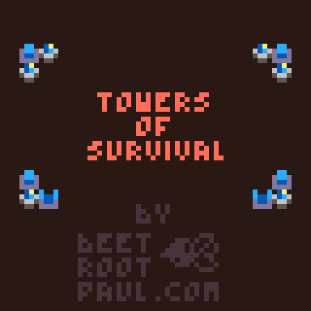
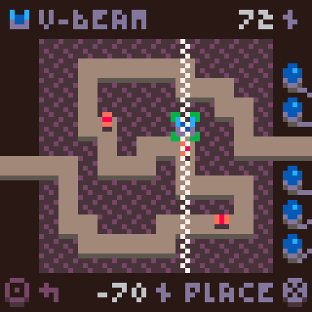

# Towers of Survival

> a low-rez tower defense [PICO-8](https://www.lexaloffle.com/pico-8.php) game

[Beetroot Paul\'s](https://beetrootpaul.com) submission for
the [LOWREZJAM 2022](https://itch.io/jam/lowrezjam-2022), which requires games
to have resolution of 64x64px.

This game is available to play in your browser
on https://beetrootpaul.itch.io/towers-of-survival

**Controls**

- in-game button `X` or keyboard key `X` or `V` - enter tower building / choose
  a selected tower / place a tower
- in-game button `O` or keyboard key `Z` or `C` - open menu / cancel
- in-game arrows or keyboard arrows - select next or previous tower / choose a
  place for a tower

---

Enemies are approaching. There are 10 waves of them. We need to survive.

There are 3 types of towers you can build:

- **laser** - the fast one,
- **v-beam** - the stronger one; its beam covers all tiles above and below,
  therefore you cannot build anything else on its way,
- **booster** - this one makes all surrounding lasers and v-beams shoot longer
  and re-charger faster; you can "stack" boosters to increase total boost – each
  laser can be boosted up to 8 times and each v-beam up to 6 times (not 8,
  because 2 tiles are reserved.

Our base have 5 cores. Each enemy is capable of destroying one core. Without
cores, we cannot survive, it's that simple.

Good luck! You are our last hope…

---

It's a [PICO-8](https://www.lexaloffle.com/pico-8.php) game, therefore I had to sacrifice some clean code practices in meeting console's
constraints. Currently stats looks like:

- the codebase uses 8136 tokens out of 8192 available (29 left, 99% used),
- the codebase consists of 64084 chars out of 65535 available (1451 left, 98%
  used).

---

--- 

Development:

1. (optional) Install [nvm](https://github.com/nvm-sh/nvm)
2. (optional) Run `nvm install` to setup proper Node.js version
3. (once) Run `npm install` to download dependencies
4. Start PICO-8 and load [towers-of-survival.p8](towers-of-survival.p8) cart
5. Run `npm start` to start a watcher which generates minified Lua sources for
   the game every time a file is changed. Please be aware all files has to be
   included (`#include`) manually in the cart's Lua itself.

Used version of PICO-8: `0.2.4c`